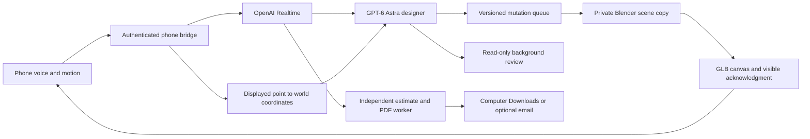

# SILTAdesign

**Point. Speak. Shape a world.**

**[Watch / download the demo recording](https://github.com/joeljussila/astrahack/releases/tag/siltadesign-demo)**

A voice-controlled design partner built for the September 8, 2026 GPT-6 Astra hackathon. Talk into your phone while an editable Blender model develops on a shared screen. Mark a place, change the brief while Astra is building, and download a materials estimate without stopping the design.

The product starts with an empty 3D canvas. It supports architectural concepts, landscapes and imaginative environments through generated Blender Python—not a fixed set of shape commands. Post-conflict reconstruction motivated the project; the implemented prototype is a general concept-design tool, not an engineered reconstruction system.

## What works

- Continuous phone conversation through OpenAI Realtime, with a separate GPT-6 Astra designer.
- Actual Blender geometry, materials, curves, modifiers and procedural detail, published as incremental GLB checkpoints.
- Mid-build requests: change colours, move an entrance or add an element at a marked location.
- Phone motion pointing. **Tap the green orb to mark a spot.** Only the separate Recenter pointer control recalibrates it. The renderer resolves the target against visible geometry or the ground plane.
- Render inspection and model-selected background review of a bounded observed concern. Reviews cannot edit and are checked for staleness.
- Serialized mutations, revision checks, protected places, failed-edit rollback and request-level undo.
- Materials-estimate PDFs saved to the computer's Downloads folder, with a visible confirmation. Optional email after configuring a sender.
- One compact animated Progress indicator, a light-grey grid and Settings. No transcript dashboard on the main screen.

## Run locally

Requires **Node.js 22+**, **Blender 4.5 LTS**, **Python 3.10+**, and an OpenAI API key with access to `gpt-6-astra`, `gpt-realtime` and `gpt-4o-transcribe`. Blender and Cloudflare are installed separately. Keys and generated scenes are not bundled.

```sh
npm ci
python -m venv .venv
```

Windows PowerShell:

```powershell
.\.venv\Scripts\python.exe -m pip install -r requirements.txt
$env:SILTA_PYTHON_PATH = (Resolve-Path .\.venv\Scripts\python.exe).Path
$env:BLENDER_PATH = 'C:\Program Files\Blender Foundation\Blender 4.5\blender.exe'
npm start
```

macOS/Linux:

```sh
.venv/bin/python -m pip install -r requirements.txt
export SILTA_PYTHON_PATH="$PWD/.venv/bin/python"
export BLENDER_PATH="/Applications/Blender.app/Contents/MacOS/Blender"
# Linux: use the absolute path from command -v blender
npm start
```

Open **http://127.0.0.1:4173/**. Enter your API key in **Settings → API connection**, or set `OPENAI_API_KEY` before starting the server. A settings-entered key stays in server memory; restarting requires reentry. Opening or refreshing the main display starts an empty world. Keep it open during a design.

### Connect your phone

Install `cloudflared`, then start a temporary HTTPS tunnel in another terminal:

```sh
cloudflared tunnel --url http://127.0.0.1:4175
```

Set `PHONE_ORIGIN` to the HTTPS origin Cloudflare prints, then start the phone bridge:

```powershell
# Windows PowerShell: substitute your own tunnel origin
$env:PHONE_ORIGIN = 'https://YOUR-TUNNEL.trycloudflare.com'
npm run phone
```

On macOS/Linux: `PHONE_ORIGIN=https://YOUR-TUNNEL.trycloudflare.com npm run phone`.

In desktop Settings, scan the QR. Enable the phone microphone and allow microphone/motion access. Move the phone while watching the screen cursor, then tap **Mark spot**. Wait for **Spot marked**, then say what to add. Motion establishes an initial neutral orientation; use **Recenter pointer** while aiming at screen centre if needed. This is calibrated motion pointing, not camera-based TV tracking. Ending the call leaves accepted building work running.

The phone tunnel is a private pairing route, not a hosted public desktop editor. Do not publish the pairing URL/token. The app executes model-generated Blender Python as a trusted local prototype; it is not a multi-user code sandbox.

## Try an interaction

1. Describe an original design, for example an underwater terraced city inspired by Machu Picchu. This is an example brief, not a bundled or prevalidated result.
2. Let geometry develop. Mark a spot and say “Move the entrance here” or “Add a shark here.”
3. While work continues, say “Change the facade to pale stone.”
4. Ask “Estimate materials for a hypothetical 100-square-metre version and download the PDF.” The report runs separately; this does not resize the model.

Complex concepts may develop over 5–10 minutes. There is no one-minute generation promise. Label accelerated recordings accordingly. The team’s demo recording is attached to the [demo release](https://github.com/joeljussila/astrahack/releases/tag/siltadesign-demo).

## Architecture



Active code: [`silta/`](silta/). Read [verification](docs/STATUS.md) and [Astra contributions](docs/ASTRA.md). Superseded planning notes are in [`docs/history/`](docs/history/). The old standalone iPhone/Excalidraw preview was removed from the current tree and remains in Git history.

## Tests and limits

```sh
npm test
```

Set the Blender and Python executable paths first. This runs real Blender integration, voice, pointing, PDF, concurrency and recovery tests without paid API calls. `npm run test:unit` excludes the real Blender fixture but still needs Python/ReportLab. The `live-*.mjs` rehearsals are opt-in, use the configured API and alter the local scene. Do not run them during somebody else's design.

Concept geometry is not engineering validation, a permit drawing or a supplier quote. Access checks are conservative bounds intersections. Reports disclose assumed quantities/rates and exclusions; specialist underwater systems may remain unpriced. Physical phone accuracy and noisy-room transcription require a handset rehearsal. Blender world/compositor/volumetric effects do not automatically transfer into GLB. SMTP is implemented, but external email delivery was not verified for this submission.
